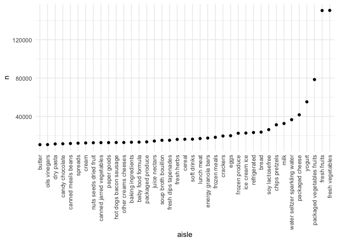
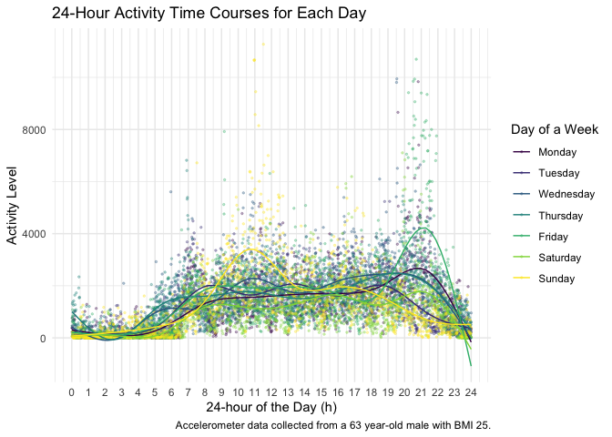
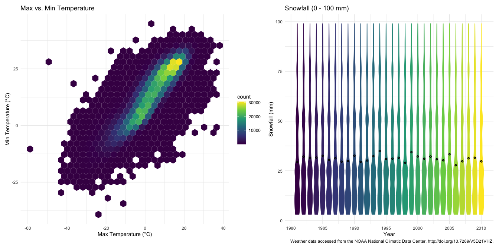

Homework 3
================
Beibei Cao
2020-10-08

### Problem 1

``` r
data("instacart")
```

This dataset contains 1384617 rows and … columns.

Observations are the level of items in orders by user. There are user /
order variables – user ID, order ID, order day, and order hour. There
are also item variables – name, aisle, department, and some numeric
codes.

How many aisles, and which are most items from?

``` r
instacart %>% 
    count(aisle) %>% 
    arrange(desc(n))
```

    ## # A tibble: 134 x 2
    ##    aisle                              n
    ##    <chr>                          <int>
    ##  1 fresh vegetables              150609
    ##  2 fresh fruits                  150473
    ##  3 packaged vegetables fruits     78493
    ##  4 yogurt                         55240
    ##  5 packaged cheese                41699
    ##  6 water seltzer sparkling water  36617
    ##  7 milk                           32644
    ##  8 chips pretzels                 31269
    ##  9 soy lactosefree                26240
    ## 10 bread                          23635
    ## # … with 124 more rows

Let’s make a plot

``` r
instacart %>% 
    count(aisle) %>% 
    filter(n > 10000) %>% 
    mutate(
        aisle = factor(aisle),
        aisle = fct_reorder(aisle, n)
    ) %>% 
    ggplot(aes(x = aisle, y = n)) + 
    geom_point() + 
    theme(axis.text.x = element_text(angle = 90, vjust = 0.5, hjust = 1))
```



Let’s make a table\!\!

``` r
instacart %>% 
    filter(aisle %in% c("baking ingredients", "dog food care", "packaged vegetables fruits")) %>% 
    group_by(aisle) %>% 
    count(product_name) %>% 
    mutate(rank = min_rank(desc(n))) %>% 
    filter(rank < 4) %>% 
    arrange(aisle, rank) %>% 
    knitr::kable()
```

| aisle                      | product\_name                                 |    n | rank |
| :------------------------- | :-------------------------------------------- | ---: | ---: |
| baking ingredients         | Light Brown Sugar                             |  499 |    1 |
| baking ingredients         | Pure Baking Soda                              |  387 |    2 |
| baking ingredients         | Cane Sugar                                    |  336 |    3 |
| dog food care              | Snack Sticks Chicken & Rice Recipe Dog Treats |   30 |    1 |
| dog food care              | Organix Chicken & Brown Rice Recipe           |   28 |    2 |
| dog food care              | Small Dog Biscuits                            |   26 |    3 |
| packaged vegetables fruits | Organic Baby Spinach                          | 9784 |    1 |
| packaged vegetables fruits | Organic Raspberries                           | 5546 |    2 |
| packaged vegetables fruits | Organic Blueberries                           | 4966 |    3 |

Apples vs. ice cream..

``` r
instacart %>% 
    filter(product_name %in% c("Pink Lady Apples", "Coffee Ice Cream")) %>% 
    group_by(product_name, order_dow) %>% 
    summarize(mean_hour = mean(order_hour_of_day)) %>% 
    pivot_wider(
        names_from = order_dow,
        values_from = mean_hour
    )
```

    ## # A tibble: 2 x 8
    ## # Groups:   product_name [2]
    ##   product_name       `0`   `1`   `2`   `3`   `4`   `5`   `6`
    ##   <chr>            <dbl> <dbl> <dbl> <dbl> <dbl> <dbl> <dbl>
    ## 1 Coffee Ice Cream  13.8  14.3  15.4  15.3  15.2  12.3  13.8
    ## 2 Pink Lady Apples  13.4  11.4  11.7  14.2  11.6  12.8  11.9

## Problem 2

This problem uses five weeks of accelerometer data collected on a 63
year-old male with BMI 25, who was admitted to the Advanced Cardiac Care
Center of Columbia University Medical Center and diagnosed with
congestive heart failure (CHF).

Load, tidy, and otherwise wrangle the accelerometer data.

``` r
# load the accel csv, transform the df from wide to long format
accel_df = 
  read_csv("./data/accel_data.csv") %>% 
  janitor::clean_names() %>% 
  pivot_longer(
   cols = starts_with("activity_"),
    names_to = "minute",
    names_prefix = "activity_",
    values_to = "activity_count"
  ) %>% 
  # encode data with reasonable variable classes, make the weekday ordered, add the weekend column
  mutate(
    week = as.integer(week),
    day_id = as.integer(day_id),
    day = as.factor(day),
    day = ordered(day, levels = c("Monday", "Tuesday", "Wednesday", "Thursday", "Friday", "Saturday", "Sunday")),
    minute = as.integer(minute),
    weekend = if_else(day %in% c("Saturday", "Sunday"), TRUE, FALSE)
  ) %>% 
  # sort by week, day and minute
  arrange(week, day, minute)
```

``` r
# preview the df
accel_df
```

    ## # A tibble: 50,400 x 6
    ##     week day_id day    minute activity_count weekend
    ##    <int>  <int> <ord>   <int>          <dbl> <lgl>  
    ##  1     1      2 Monday      1              1 FALSE  
    ##  2     1      2 Monday      2              1 FALSE  
    ##  3     1      2 Monday      3              1 FALSE  
    ##  4     1      2 Monday      4              1 FALSE  
    ##  5     1      2 Monday      5              1 FALSE  
    ##  6     1      2 Monday      6              1 FALSE  
    ##  7     1      2 Monday      7              1 FALSE  
    ##  8     1      2 Monday      8              1 FALSE  
    ##  9     1      2 Monday      9              1 FALSE  
    ## 10     1      2 Monday     10              1 FALSE  
    ## # … with 50,390 more rows

The `accel_df` contains `50400` observations of `6` variables related to
accelerometer data collected on the male. The `week` is an integer
variable indicating the nth week of the observation (`1 - 5`); the
`day_id` is an integer variable indicating a unique id of the specific
day from `1` to `35`; the `day` is an ordered factor variable indicate
the day of the week; the `activity_count` is a double numeric variable
represents the activity counts in each minute ranging from `1` to
`8982`; the `weekend` is a logical variable indicating whether the day
is a weekend or not.

Using the tidied dataset, aggregate accross minutes to create a total
activity variable for each day, and create a table showing these totals.

``` r
# group by week and day
accel_df %>% 
  group_by(week, day) %>% 
  # add up activity count of each day
  summarise(day_sum = sum(activity_count)) %>% 
  # format the table into wide 
  pivot_wider(
    names_from = day,
    values_from = day_sum
  ) %>% 
  knitr::kable(align = "crrrrrrr")
```

| week |    Monday |  Tuesday | Wednesday | Thursday |   Friday | Saturday | Sunday |
| :--: | --------: | -------: | --------: | -------: | -------: | -------: | -----: |
|  1   |  78828.07 | 307094.2 |    340115 | 355923.6 | 480542.6 |   376254 | 631105 |
|  2   | 295431.00 | 423245.0 |    440962 | 474048.0 | 568839.0 |   607175 | 422018 |
|  3   | 685910.00 | 381507.0 |    468869 | 371230.0 | 467420.0 |   382928 | 467052 |
|  4   | 409450.00 | 319568.0 |    434460 | 340291.0 | 154049.0 |     1440 | 260617 |
|  5   | 389080.00 | 367824.0 |    445366 | 549658.0 | 620860.0 |     1440 | 138421 |

Visualize the trends of the total activity in the five week on each day.

``` r
theme_set(theme_minimal() + theme(legend.position = "right"))
# visualize the trends of the total activity variable
 accel_df %>% 
  group_by(week, day) %>% 
  # add up activity count of each day
  summarise(day_sum = sum(activity_count)) %>% 
  ggplot(aes(x = day ,y = day_sum, group = week, color = week)) + 
  geom_line() + 
  geom_point() +
  labs(
    title = "Total Activity Counts of Each Day in the Week",
    x = "Day of the Week",
    y = "Day Activity Counts",
    color = "Day of the week",
    caption = "Accelerometer data collected from a 63 year-old male with BMI 25."
    ) 
```


No significant trend could be observed except for that in week 4 and
week 5 very little activity was observed on Saturday and not many
activities on Sunday.

Make a single-panel plot that shows the 24-hour activity time courses
for each day and use color to indicate day of the week.

``` r
accel_df %>% 
  group_by(day, minute) %>% 
  # add up activity count of each day in the week across five weeks
  summarise(weekday_sum = sum(activity_count)) %>% 
  # plot with activity count of each day across five weeks against day time
  ggplot(aes(x = minute, y = weekday_sum, color = day)) + 
  geom_point(alpha = 0.3, size = 0.5) +
  geom_smooth(size = 0.5, se = FALSE) +
  labs(
    title = "24-Hour Activity Time Courses for Each Day",
    x = "24-hour of the Day (h)",
    y = "Activity Level",
    color = "Day of a Week",
    caption = "Accelerometer data collected from a 63 year-old male with BMI 25."
    ) +
  scale_x_continuous(
    breaks = c(seq(0, 1440, by = 60)),
    labels = c(seq(0, 24, by = 1))
    ) 
```



Generally, low activities levels could be observed from `23 p.m.` to `5
a.m.`, when it was probably that the man was asleep. The activity levels
peaked a little bit around the middle of each day (especially Sunday)
and the end of each day (especially Friday), indicating there might be
regular activities around that time.

## Problem 3

This problem uses the NY NOAA weather data.

Load the data.

``` r
data("ny_noaa")
```

Some data cleaning.

``` r
tidy_naoo_df = 
  ny_noaa %>% 
  # create separate variables for year, month, and day
  separate(date, c("year", "month", "day")) %>%
  # recode column types and make variable prcp, tmin and tmax to have mm and degree C as units.
  mutate(
    year = as.integer(year),
    month = month.name[as.numeric(month)],
    day = as.integer(day),
    prcp = as.numeric(prcp) / 10,
    tmin = as.numeric(tmin) / 10,
    tmax = as.numeric(tmax) / 10
    )
```

Check the most commonly observed values in snowfall.

``` r
# count the occurrence of snow records and rank
tidy_naoo_df %>% 
  drop_na(snow) %>% 
  group_by(snow) %>% 
    count(snow) %>% 
  ungroup() %>% 
    mutate(rank = min_rank(desc(n))) %>% 
    filter(rank < 6) %>% 
  arrange(rank) %>% 
  knitr::kable(align = "ccc") 
```

| snow |    n    | rank |
| :--: | :-----: | :--: |
|  0   | 2008508 |  1   |
|  25  |  31022  |  2   |
|  13  |  23095  |  3   |
|  51  |  18274  |  4   |
|  76  |  10173  |  5   |

The most commonly observed value is `0`, which indicates that for the
most of the time there is no snow.

Make a two-panel plot showing the average max temperature in January and
in July in each station across years.

``` r
# subset data and calculate average max temperature for each station in the January and July
tidy_naoo_df %>% 
  filter(month %in% c("January", "July")) %>% 
  group_by(id, year, month) %>% 
  summarise(mean_tmax = mean(tmax)) %>% 
  # Make a two-panel plot showing the average max temperature in January and in July in each station across years
  ggplot(aes(x = year, y = mean_tmax, color = id)) + 
  geom_point(alpha = 0.4, size = 0.7) +
  labs(
    title = "New York State Average Max Temperature in January and July",
    x = "Year",
    y = "Average Max Temperature (°C)",
    caption = "Weather data accessed from the NOAA National Climatic Data Center, http://doi.org/10.7289/V5D21VHZ."
  ) +
  scale_x_continuous(
    breaks = c(seq(1980, 2010, by = 5)),
    labels = c(seq(1980, 2010, by = 5))
  ) +
  theme(legend.position = "none") + 
  facet_grid(. ~ month)
```


The average max temperature are well distributed around `0°C (~ -10°C
to 10°C)` and `27°C (~ 20°C to 35°C)` in January and July respectively
across the years. Few outliers could be observed.

Plot `tmax` vs. `tmin` for the full dataset.

``` r
# plot with geom_hex(), x = tmin, y = tmax, the color indicates level of counts (density of points)
tmax_tmin_plot = 
  tidy_naoo_df %>%
  drop_na() %>% 
  ggplot(aes(x = tmin, y = tmax)) + 
  geom_hex() +
  labs(
    title = "Max vs. Min Temperature",
    x = "Max Temperature (°C)",
    y = "Min Temperature (°C)"
  ) +
  theme(legend.position = "right")
```

Make a plot showing the distribution of snowfall values greater than `0`
and less than `100` separately by year.

``` r
# use violin plot to show the distribution of snowfall in each year, mean indicated
snow_plot = 
  tidy_naoo_df %>%
  drop_na() %>% 
  filter(snow > 0 & snow < 100) %>%
  ggplot(aes(x = year, y = snow, group = year, fill = year, color = year)) +
  geom_violin() +
  stat_summary(shape = 23, size = 0.2, color = "black") +
    labs(
    title = "Snowfall (0 - 100 mm)",
    x = "Year",
    y = "Snowfall (mm)",
    caption = "Weather data accessed from the NOAA National Climatic Data Center, http://doi.org/10.7289/V5D21VHZ."
  ) +
  scale_x_continuous(
    breaks = c(seq(1980, 2010, by = 5)),
    labels = c(seq(1980, 2010, by = 5))
  ) +
  theme(legend.position = "none")
```

Show two plots with Patchwork.

``` r
tmax_tmin_plot + snow_plot 
```



Check missing values for each column.

``` r
# sum the na in each variable
tidy_naoo_df %>% 
  is.na() %>% 
  colSums() 
```

    ##      id    year   month     day    prcp    snow    snwd    tmax    tmin 
    ##       0       0       0       0  145838  381221  591786 1134358 1134420

The `tidy_naoo_df` contains `2595176` observations of `9` variables
related to New York state weather data accessed from the NOAA National
Climatic Data Center. The variable `id` contains id of `747` stations
that the data was collected from. The variable `year` (1981 - 2010),
`month` and `day` contains the date information. The variable `prcp` is
a double numeric variable containing data of precipitation with unit
`mm`. The variable `snow` and `snwd` are integer variables containing
data of snowfall and snow depth with units `mm`. The variable `tmax` and
`tmin` are double numeric variables containing data of max and min
temperatures with unit `°C`. The number of missing values for each
variable are shown above. The `prcp`, `snow` and `snwd` variable have
few missing values compared with the data size. The `tmax` and `tmin`
variable have relatively more missing values however. These values are
ignored when plotting.

From the first plot in the two-panel plot, it could be observed that the
tmax vs. tmin data points are generally distributed along a linear
function with positive gradient and negative y-axis intercept, with a
concentration between `(-20°C, -10°C)` and `(20°C, 30°C)`. The second
plot indicated that the distribution of snowfall amount in each year did
not vary much and their mean values were pretty consistent around `~30
mm`.
